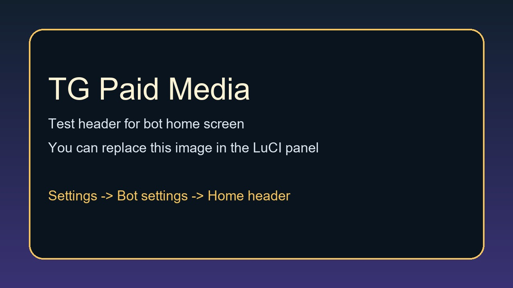

# TG Paid Media для OpenWrt

<p align="center">
  
</p>

<p align="center">
  <strong>Telegram Paid Media бот + панель LuCI + Telegram Stars + RUB-платежи в одном пакете для OpenWrt.</strong>
</p>

<p align="center">
  Запускайте бота с платным контентом прямо на роутере, управляйте им через LuCI, принимайте Telegram Stars, подключайте СБП и YooMoney и держите под контролем статус сервиса, логи, webhook и reverse tunnel в одном месте.
</p>

<p align="center">
  <a href="https://openwrt.org/"></a>
  <a href="#license"></a>
  
  
  
</p>

## Содержание

- [Зачем нужен этот проект](#зачем-нужен-этот-проект)
- [Что вы получаете](#что-вы-получаете)
- [Быстрая установка](#быстрая-установка)
- [Первый запуск за 5 минут](#первый-запуск-за-5-минут)
- [Платежи](#платежи)
- [Что дает LuCI](#что-дает-luci)
- [Команды администратора](#команды-администратора)
- [Структура проекта](#структура-проекта)
- [Для кого это](#для-кого-это)
- [Удаление](#удаление)
- [Лицензия](#лицензия)

## Зачем нужен этот проект

`TG Paid Media` создан для тех, кто хочет поднять self-hosted витрину платного контента в Telegram без отдельной VPS-панели, тяжелой CMS или самописного backend. Проект объединяет runtime бота и интерфейс LuCI в один пакет, удобный для OpenWrt.

Почему это удобно:

- Продавайте фото и видео через Telegram Paid Media.
- Принимайте нативные платежи в Telegram Stars.
- Добавляйте RUB-платежи через `Platega` и `YooMoney`.
- Запускайте все как обычный сервис OpenWrt.
- Настраивайте бота через LuCI без ручного редактирования файлов.
- Следите за состоянием сервиса, логами, webhook и reverse tunnel в одном интерфейсе.

## Что вы получаете

### Основные возможности

- Telegram-бота для каталога платного контента и его выдачи.
- Хранение каталога в `JSON` с сохранением состояния бота.
- Админский workflow для добавления, редактирования, публикации и удаления товаров.
- Статистику продаж в Telegram Stars и просмотр последних транзакций.
- RUB-цены для каждого товара под внешние платежные сценарии.

### Интеграция с OpenWrt и LuCI

- Нативную страницу LuCI в `Services -> TG Paid Media`.
- Кнопки запуска, остановки и перезапуска сервиса бота.
- Обзор состояния сервиса со счетчиками, последними событиями, подсказками по рестартам и недавними ошибками.
- Встроенный просмотр логов для быстрой диагностики без лишней работы в shell.
- Экран настроек для токена, `Admin IDs`, путей, платежных параметров и домашней шапки.

### Платежные возможности

- Поддержку `Platega` для оплаты через СБП.
- Поддержку `YooMoney` с webhook endpoint и hosted payment flow.
- Быструю мини-проверку YooMoney для:
  - состояния сервиса
  - notification secret
  - доступности webhook
  - состояния reverse tunnel
- Быструю кнопку включения и остановки `Reverse tunnel` прямо внутри мини-проверки YooMoney.

### Развертывание под роутер

- Проектирование под окружение OpenWrt.
- Скрипт установки с поддержкой систем на `opkg` и новых образов с `apk`.
- Локальное размещение и управление прямо из панели роутера.

## Быстрая установка

Установка напрямую с GitHub:

```sh
wget -qO- "https://raw.githubusercontent.com/kzolotarev95/luci-app-tg-paidmedia/main/openwrt/install.sh?v=$(date +%s)" | sh
```

После установки откройте:

```text
LuCI -> Services -> TG Paid Media
```

## Первый запуск за 5 минут

### 1. Установите пакет

Запустите команду установки выше от имени `root`.

### 2. Откройте страницу LuCI

Перейдите сюда:

```text
Services -> TG Paid Media
```

### 3. Заполните базовые параметры бота

В настройках укажите:

- `Bot token`
- `Admin IDs`
- `Bot title`
- `Welcome text`
- при желании домашнюю шапку с изображением

### 4. Включите и запустите сервис

Включите бота, сохраните конфиг и запустите или перезапустите сервис из блока статуса.

### 5. Добавьте первый платный контент

Используйте админ-команды в Telegram, чтобы собрать каталог:

- `/addphoto <stars> <title>`
- `/addvideo <stars> <title>`
- `/items`
- `/publish <id>`

После этого у вас уже будет рабочий paid media бот с поддержкой Telegram Stars.

## Платежи

### Telegram Stars

Бот поддерживает Telegram Stars как нативный способ оплаты платного контента внутри Telegram.

### Platega

Используйте `Platega`, если хотите принимать RUB-платежи через СБП. Бот отслеживает создание заказа, статус оплаты и последние платежные события.

### YooMoney

Используйте `YooMoney`, если вам нужна прямая RUB-страница оплаты и подтверждение через webhook.

В проект уже входят:

- настройки webhook host, port и path
- `callback URL` и `success URL`
- проверка `notification secret`
- мини-проверка YooMoney в LuCI
- опциональный reverse SSH tunnel для роутеров за NAT или без публичного входящего порта

## Что дает LuCI

Страница LuCI сделана так, чтобы быстро отвечать на главные вопросы:

- Бот сейчас запущен или нет?
- Включен ли автозапуск?
- Сколько товаров и администраторов настроено?
- Сколько было покупок через Stars, СБП и YooMoney?
- Какое последнее платежное событие пришло?
- Почему сервис перезапускался?
- В порядке ли `YooMoney secret`, `webhook` и `reverse tunnel`?

Именно эта часть делает проект не просто устанавливаемым, а реально удобным в эксплуатации.


## Структура проекта

```text
luci-app-tg-paidmedia/
|-- README.md
|-- assets/
|   `-- bot-home-header.jpg
|-- openwrt/
|   |-- install.sh
|   `-- uninstall.sh
|-- luci-app-tg-paidmedia/
|   |-- Makefile
|   |-- htdocs/luci-static/resources/view/tg-paidmedia/
|   |   `-- overview.js
|   `-- root/usr/share/
|       |-- luci/menu.d/luci-app-tg-paidmedia.json
|       `-- rpcd/acl.d/luci-app-tg-paidmedia.json
`-- tg-paidmedia-bot/
    |-- Makefile
    `-- files/
        |-- etc/
        |   |-- config/tg-paidmedia
        |   |-- init.d/tg-paidmedia
        |   `-- tg-paidmedia/catalog.json
        `-- usr/libexec/tg-paidmedia/
            |-- bot.py
            `-- yoomoney-tunnel.sh
```

## Для кого это

- Для авторов, которые хотят продавать приватные фото или видео в Telegram.
- Для пользователей OpenWrt, которым ближе self-hosted сервисы, чем сторонние панели.
- Для владельцев роутеров и homelab, которым нужна Telegram-автоматизация с платежами.
- Для тех, кому нужен практичный способ вывести YooMoney webhook из NATed-окружения.

## Удаление

Если нужно полностью удалить проект:

```sh
wget -qO- "https://raw.githubusercontent.com/kzolotarev95/luci-app-tg-paidmedia/main/openwrt/uninstall.sh?v=$(date +%s)" | sh
```

## Лицензия

MIT
